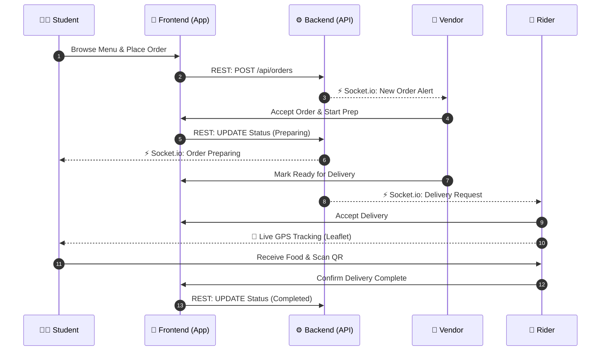

# Foodzie Frontend 🍔🚀

**Foodzie** is a comprehensive campus food-ordering platform designed to streamline the university dining experience. It connects students, canteen vendors, delivery personnel, and campus administrators into a single, cohesive real-time ecosystem.

---

## 📖 Overview

The Foodzie frontend is a modern, responsive, and dynamic web application built to handle various campus food delivery workflows. By leveraging real-time data, geospatial tracking, and an intuitive UI, Foodzie aims to minimize canteen queues, provide vendors with actionable analytics, and ensure students get their meals hot and on time.

The platform provides dedicated, specialized dashboards and flows for four distinct user roles:
- **Students (Customers):** Browse campus menus, customize orders, track live deliveries, and pay via QR codes/UPI.
- **Vendors (Canteens):** Manage digital menus in real-time, accept/reject incoming orders, view business analytics, and manage canteen employees.
- **Delivery Personnel (Riders):** Accept assigned deliveries, update statuses, navigate using live maps, and track cash-on-delivery (COD) deposits.
- **Administrators:** Oversee platform health, monitor cross-university analytics, manage user roles, and seamlessly toggle global platform branding.

### 🔄 Order Lifecycle Workflow



---

## ✨ Key Features

- **Real-Time Order Tracking:** Integrated with `socket.io-client` and `react-leaflet` to provide live GPS tracking and instant order status updates.
- **Dynamic Multi-Currency Support:** Automatically adapts to the user's university location, formatting all monetary values correctly (e.g., `₹` for India, `$` for international).
- **Interactive Dashboards:** Built using `recharts` to provide vendors and admins with rich, visual data analytics, sales trends, and order distribution charts.
- **Robust State Management:** Utilizes `zustand` for lightweight, persistent client-side state management (like shopping carts and UI states).
- **QR Code Scanning:** Includes integrated `html5-qrcode` scanning for seamless delivery hand-offs and payments.
- **Dark Mode Support:** Fully integrated with `next-themes` and styled beautifully using Tailwind CSS for a premium aesthetic in any lighting.

---

## 🛠️ Technology Stack

This project is built using industry-standard, bleeding-edge web technologies:

<p align="center">
  <a href="https://nextjs.org/"></a>
  <a href="https://react.dev/"></a>
  <a href="https://tailwindcss.com/"></a>
  <a href="https://lucide.dev/"></a>
  <a href="https://zustand-demo.pmnd.rs/"></a>
  <a href="https://socket.io/"></a>
  <a href="https://leafletjs.com/"></a>
  <a href="https://recharts.org/"></a>
  <a href="https://supabase.com/"></a>
</p>

- **Framework:** [Next.js 14](https://nextjs.org/) (App Router)
- **Library:** [React 18](https://react.dev/)
- **Styling:** [Tailwind CSS](https://tailwindcss.com/)
- **Icons:** [Lucide React](https://lucide.dev/)
- **State Management:** [Zustand](https://zustand-demo.pmnd.rs/)
- **Real-Time Communication:** [Socket.IO Client](https://socket.io/)
- **Maps & Geolocation:** [Leaflet](https://leafletjs.com/) & [React-Leaflet](https://react-leaflet.js.org/)
- **Data Visualization:** [Recharts](https://recharts.org/)
- **Database/Auth SDK:** [Supabase JS](https://supabase.com/)

---

## 🚀 Getting Started

Follow these instructions to set up the frontend locally.

### Prerequisites

Ensure you have the following installed:
- **Node.js** (v18 or newer recommended)
- **npm** or **yarn**

### Installation

1. **Install dependencies:**
   ```bash
   npm install
   ```

2. **Set up Environment Variables:**
   Duplicate the `.env.example` file and rename it to `.env.local`. Fill in your API keys, backend URL, and Supabase credentials.
   ```bash
   cp .env.example .env.local
   ```

3. **Run the Development Server:**
   ```bash
   npm run dev
   ```

4. **Access the Application:**
   Open [http://localhost:3000](http://localhost:3000) with your browser to see the app running.

---

## 📁 Project Structure

```text
frontend/
├── app/                  # Next.js 14 App Router pages and layouts
│   ├── admin/            # Admin dashboard views
│   ├── delivery/         # Delivery personnel views
│   ├── shop/             # Customer-facing canteen menus
│   └── vendor/           # Canteen vendor dashboard views
├── components/           # Reusable UI components (Modals, Icons, Charts)
├── context/              # React Context providers (Brand, Currency)
├── lib/                  # Utilities, API configurations, and Zustand stores
├── public/               # Static assets (images, fonts, etc.)
└── package.json          # Project dependencies and scripts
```

---

*Designed & Built for the future of campus dining.*
